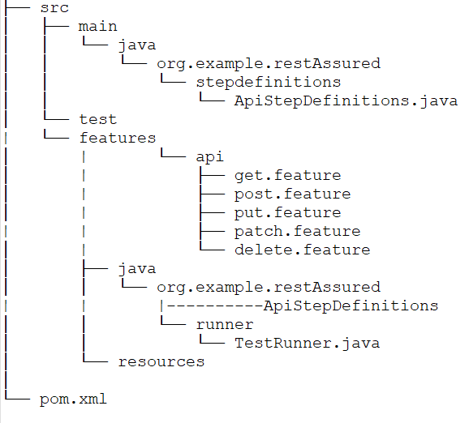
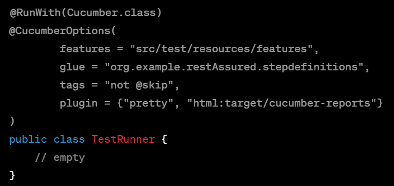

# RestAssured Test Framework

This is a sample test framework for REST APIs using RestAssured and Cucumber. It contains feature files and corresponding step definitions for testing the https://jsonplaceholder.typicode.com API.

## Prerequisites
* Java 8 or higher
* Maven 3.0 or higher

## Getting Started

1. Clone the repository to your local machine.
2. Open the project in your IDE.
3. Open the terminal and navigate to the project directory.
4. Run the command mvn test to run the test suite.

## Project Structure

* **src/main/java/org.example.restAssured.stepdefinitions**: Contains the step definitions for the Cucumber feature files.
* **src/test/java/org.example.restAssured.runner**: Contains the test runner file.
* **src/test/resources/features/api**: Contains the feature files for testing different endpoints of the API.
* **pom.xml**: Contains the dependencies and plugins required for the project.

## Adding New Tests
1. Create a new feature file in src/test/resources/features/api directory.
2. Write the scenarios in Gherkin syntax.
3. Create the corresponding step definitions in ApiStepDefinitions.java.
4. Run the test suite using the command mvn test.

## Excluding Tests
If you want to exclude certain tests from the test run, you can do so by using tags. Add **tags** to the feature file scenarios and then use the tags attribute in the **TestRunner.java** file to exclude those tests.

For example, to exclude tests with the **tag @skip**, use the following code:

## Reporting

After running the test suite, the test results can be viewed in the target/cucumber-reports directory. The directory contains an HTML report and a JSON report.

## Troubleshooting

If you encounter any issues while running the test suite, try the following steps:

1. Make sure that you have installed the prerequisites mentioned above.
2. Make sure that you have set the correct baseURI in ApiStepDefinitions.java.
3. Check the console output for error messages.
4. Check the test logs in the target/cucumber-reports directory.

## SWEET NOTE:

"I would like to take this opportunity to express my sincere gratitude to all my guides and support available over the web. Your guidance, encouragement, and support have been invaluable in helping me achieve my goals. I couldn't have done it without you. Thank you for sharing your knowledge and expertise with me. I will always be grateful to you for your help and support."

Additionally, if you have any further queries, support requests, or work opportunities, please feel free to reach out to me at anil.dhiman88@gmail.com. I will be happy to assist you in any way I can.